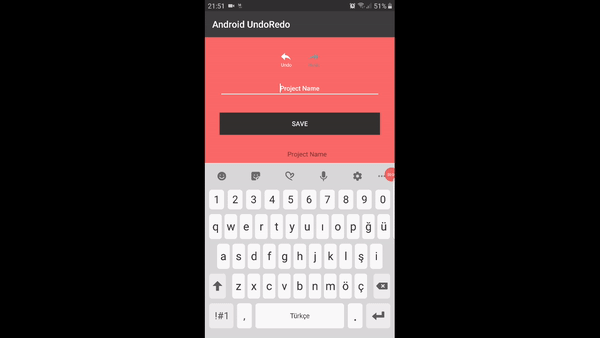

# **Android Undo Redo Sample** 

## Overview
### In this project I will cover the "Undo Redo" process in an Android App. 

---

This project is based on Memento Design Pattern for saving and restoring scenario.




Basically Memento Pattern has Originator, Memento and Caretaker classes.

* i) Originator Class is your entity/model object.
    eg
    ```
    class User{
        id;
        name;
        lastname;
        username;
    }
    ```
    or 
    ```
    class Project{
        id;     
        name;
        user;
    }
    ```


    Originator class has two methods:
    create memento object & restore originator object from memonto's states.
    If you are using an ORM lib/API, you could you transient annotations for these methods.


* ii) Memonto class is copy of the originator class and include its states.
    eg
    ```
    class UserMemento{
      id;
      name;
      lastname;
      username;
    }
    ```
    or 
    ```
    class ProjectMemento{
        id;     
        name;
        userMemento;
    }
    ```

* iii) CareTaker class manages memento and originator's states. 
    ``` 
    class CareTaker{
     stack of Redo; 
     stack of Undo;
    }
    ```
    We have two stack, they manages state transition between previous state or prior state.


* UndoRedo class manages Caretaker class and triger the callback listener methods.


### Reflection

### 1. Pipeline:


My pipeline consisted of a few steps. First, I initialzed UI components in activity and initialize UndoRedo  class that manages CareTaker class.

When we save a project with name. 
```
public void onClick(View view){
 if(viewId == R.id.buttonSaveProjectID ) {
    crate a project and project call crate memento method and add to Undo Stack.
    If project exist we change only the project's name
}
``` 


We check Undo and Redo buttons with isRedoIsPossible() & isUddoIsPossible() methods.
It checks Undo & Redo stacks' size.

In UndoRedo class:
```
    public boolean isUndoIsPossible(){
        return projectCareTaker.isUndoPossible();
    }

    public boolean isRedoIsPossible(){
        return  projectCareTaker.isRedoPossible();
    }

```
In CareTaker class:
```
    public boolean isUndoPossible(){
        if (UndoStack.size() >= 1){
            return true;
        }
        return false;
    }


    public boolean isRedoPossible(){
        if (RedoStack.size() >= 1){
            return  true;
        }
        return false;
    }
```


### 2. Potential shortcomings


One potential shortcoming is the implementation is not designed based on Dependency Injection criteria.
Implementation is too tightly coupled :)


### 3. Possible improvements

Change the UndoRedo class implementation as Injectable Service.
Originator classes' functions could change as Java Generic Type or maybe use reflections.

It is a sample code base, feel free to change the code and give your suggestions!
